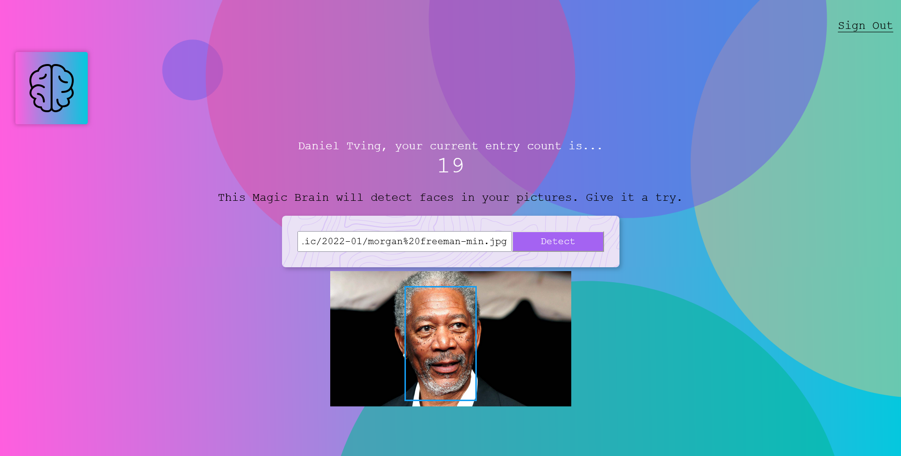

# Smart Brain Frontend - Face Detection App

Smart Brain is a web-based face detection application that uses AI to identify faces in user-uploaded images. This project is part of the Complete Web Developer Course by Zero To Mastery and demonstrates full-stack development skills, including React for the front-end and Node.js with PostgreSQL for the back-end. For detailed information about the backend implementation, please refer to the [backend repository](https://github.com/dantvi/smart-brain-api). 

## Table of contents

- [Smart Brain Frontend - Face Detection App](#smart-brain-frontend---face-detection-app)
  - [Table of contents](#table-of-contents)
  - [Overview](#overview)
    - [Screenshot](#screenshot)
    - [Links](#links)
    - [Built with](#built-with)
      - [Frontend](#frontend)
      - [Backend](#backend)
      - [Other Tools](#other-tools)
    - [How It Works](#how-it-works)
    - [What I learned](#what-i-learned)
    - [Continued development](#continued-development)
    - [Setup Instructions](#setup-instructions)
    - [Useful resources](#useful-resources)
  - [Author](#author)
  - [Acknowledgments](#acknowledgments)

## Overview

The Smart Brain App allows users to:
- Face Detection: Upload an image, and the application will detect faces using an AI model.
- User Authentication: Register or sign in to track your face detection activity.
- Interactive Design: Intuitive UI with animations and responsive elements.

### Screenshot



### Links

- Frontend: [GitHub Repository](https://github.com/dantvi/smart-brain)
- Backend API: [GitHub Repository](https://github.com/dantvi/smart-brain-api)
- Live Site URL: [DT Code](https://smart-brain.dtcode.se/)

### Built with

#### Frontend
- React: For building the user interface.
- Tachyons: For styling the application.
- Particles-bg: For adding dynamic background particles.
#### Backend
- Node.js & Express: For handling server-side logic and routing.
- PostgreSQL: For user and activity data storage.
- Clarifai API: For face detection functionality.
#### Other Tools
- RESTful APIs: For communication between the client and server.
- One.com is used for hosting the front-end, while Heroku is used for the back-end deployment.

### How It Works

- User Authentication:
  - Users can register with their name, email, and password.
  - Returning users can log in with their credentials.
- Face Detection:
  - Users enter the URL of an image.
  - The app sends the URL to the back-end, which then uses the Clarifai API to analyze the image.
  - Detected faces are highlighted on the image.
- Leaderboard:
  - The app tracks the number of detections for each user and displays their progress on the dashboard. 
  - The leaderboard dynamically displays user activity, relying on backend data. 

### What I learned

This project allowed me to:
- Build a complete full-stack application using React, Node.js, and PostgreSQL.
- Work with third-party APIs (Clarifai) to integrate AI functionality.
- Enhance user authentication with server-side validation.
- Use React components and props to create a modular, reusable codebase.

Here’s an example of the component handling face detection and image display:

```jsx
import './face-recognition.styles.css';

const FaceRecognition = ({ imageUrl, box }) => {
  return (
    <div className="center ma">
      <div className="absolute mt2">
        
        <div
          className="bounding-box"
          style={{
            top: box.topRow,
            right: box.rightCol,
            bottom: box.bottomRow,
            left: box.leftCol,
          }}
        ></div>
      </div>
    </div>
  );
};

export default FaceRecognition;
```

This component:
- Displays the submitted image.
- Highlights the detected face using the bounding box coordinates passed as props.

### Continued development

In future iterations, I plan to:
- Add image upload functionality directly from the user's device.
- Improve the UI/UX with additional animations and themes.
- Implement multi-face detection and detailed analysis.
- Optimize for mobile performance. 

### Setup Instructions

1. Clone the repository: 
```bash
git clone https://github.com/dantvi/smart-brain.git
cd smart-brain
```
2. Install dependencies:
```bash
npm install
```
3. Start the development server: 
```bash
npm start
```

Note: Ensure the backend is set up and running for the face detection functionality to work.

### Useful resources

- [React Docs: Quick Start](https://react.dev/learn) - An excellent guide to learn and master React's core concepts.
- [Clarifai API Documentation](https://docs.clarifai.com/) - Essential documentation for integrating the face detection API.
- [NPM Particles-bg](https://www.npmjs.com/package/particles-bg) - A useful library for creating engaging background animations.
- [NPM React Parallax Tilt](https://www.npmjs.com/package/react-parallax-tilt) - Used to create smooth 3D parallax effects for UI components like the logo.
- [Tachyons Documentation](https://tachyons.io/docs/) - Detailed reference for Tachyons CSS framework used to style the app.

## Author

- GitHub - [@dantvi](https://github.com/dantvi)
- LinkedIn - [@danieltving](https://www.linkedin.com/in/danieltving/)

## Acknowledgments

Special thanks to Zero To Mastery for offering a well-structured course that provided a strong foundation in web development. A big shoutout to the instructor and founder, Andrei Neagoie, whose expertise and ability to explain complex concepts in simple terms made learning an enjoyable and enriching experience. Furthermore, platforms like MDN Web Docs and Stack Overflow were invaluable resources during the development process.
